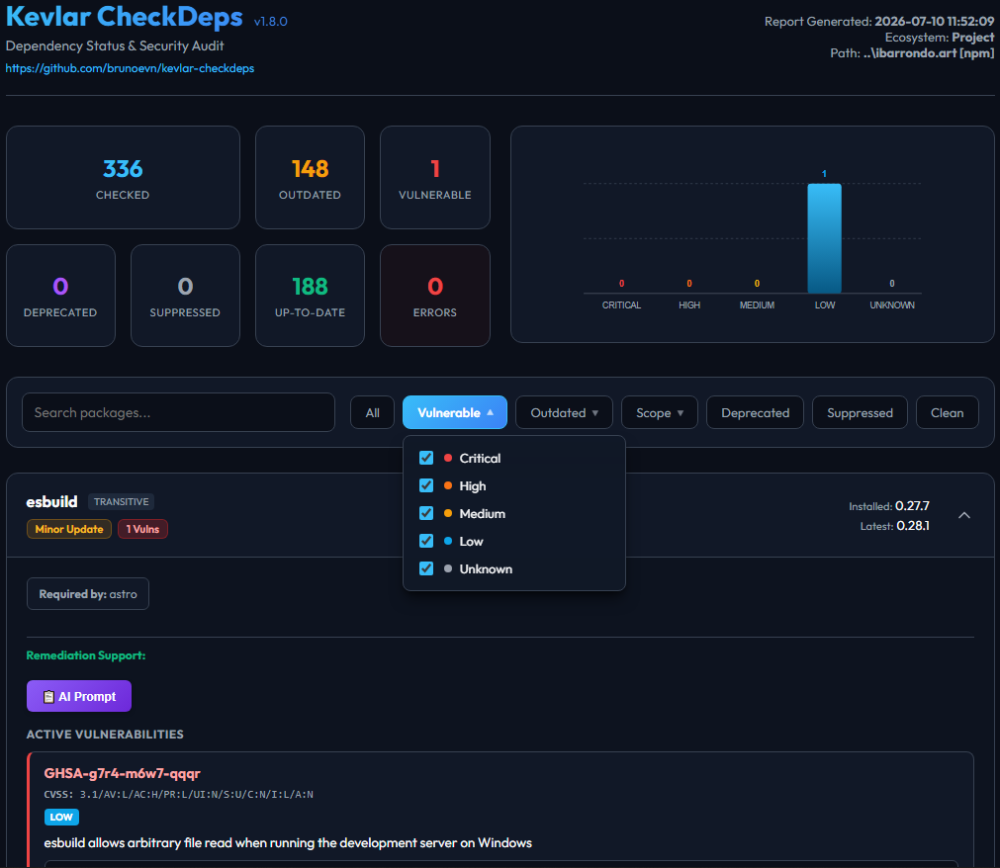

# 🛡️ Kevlar CheckDeps

A powerful, fast, and self-contained command-line utility written in Python to scan project dependencies (SCA). It identifies **outdated versions**, **deprecation notices** (yanked packages), and **security vulnerabilities** by querying package registries (npm/PyPI/NuGet/Packagist/Maven Central/Go Proxy/crates.io/RubyGems) and the Google OSV (Open Source Vulnerabilities) database.

Designed with a modular and extensible architecture, it supports checking direct and transitive dependencies and requires **zero external python package installations**.



---

## Key Features

- **Multi-Ecosystem Support**: Audits:
  - **Node.js (`npm`) & Engines**: supporting `package.json` (including `peerDependencies` and `optionalDependencies`), `package-lock.json`, Yarn `yarn.lock` (supporting both Yarn Classic v1 and Yarn Berry v2/v3/v4 modern formats with checksum normalization), and pnpm `pnpm-lock.yaml` (supporting lockfile v5, v6, and v9). Audits declared Node.js version constraints (`engines.node`, `.nvmrc`, `.node-version`) against EOL and maintenance schedules fetched dynamically from official sources.
  - **Python (`pip`)**: supporting `requirements.txt` (with PEP 508 environment markers and direct `@` URLs), Poetry `poetry.lock` + `pyproject.toml`, Pipenv `Pipfile.lock`, and PDM `pdm.lock`.
  - **.NET (`nuget`)**: supporting C# `.csproj`, VB.NET `.vbproj`, F# `.fsproj`, Solution files (`.sln`), and Central Package Management (`Directory.Packages.props`).
  - **PHP (`php`)**: supporting `composer.json` and `composer.lock`.
  - **Java (`maven`)**: supporting multi-module `<modules>`, centralized `<dependencyManagement>`, and recursive parent POM properties/dependency inheritance.
  - **Java/Kotlin (`gradle`)**: supporting `build.gradle`, `build.gradle.kts`, `gradle.lockfile`, and Version Catalogs `libs.versions.toml`.
  - **Android (`android`)**: prioritizing Google's Maven Registry for Android libraries.
  - **Go (`go`)**: supporting `go.mod` (including module `replace` directives to accurately resolve local or overridden dependencies).
  - **Rust (`rust`)**: supporting `Cargo.toml` and `Cargo.lock` (including native v4 lockfile formats).
  - **Ruby (`ruby`)**: supporting `Gemfile` and `Gemfile.lock`.
- **Outdated Package Detection**: Compares installed versions against the latest versions in registries, classifying updates into `Major`, `Minor`, and `Patch` increments, as well as composite status like `Minor/Major` and `Patch/Major` when both a safe same-major update and a major version update are available.
- **Configuration Drift Validation**: Automatically detects installed packages that violate declared semver constraint ranges, flagging them with an `error` status and detailed troubleshoot diagnostics. Supports Yarn Berry workspace dependencies (`workspace:`), alias overrides (`npm:`), patch protocols (`patch:`, `portal:`, `link:`), and central catalogs (`catalog:`), ignoring local-only/configuration protocols to eliminate false positives.
- **Deprecation Warnings**: 
  - For `npm`: Extracts maintainer deprecation notices for exact installed versions.
  - For `pip`: Identifies and reports "yanked" (deprecated/withdrawn) releases on PyPI.
  - For `rust`: Identifies and reports "yanked" crates on crates.io.
- **Security Vulnerability Audits**: Queries the public Google OSV database to identify active vulnerabilities, including CVE/GHSA IDs, CVSS vectors, and advisory summaries.
- **Malicious Code Detection (`MAL-`)**: Automatically classifies packages flagged with `MAL-` vulnerability IDs (indicating known malicious payload distributions) under a high-priority `malicious` severity. These threats are prioritized at the top of all reports, decorated with dedicated UI indicators (such as `☠️ MALICIOUS CODE` badges and custom glow filters in HTML reports), tracked separately in final summaries, and can be isolated via interactive dashboard filters.
- **Transitive Parent Tracing**:
  - For `npm`: Recursively builds a dependency graph from `package-lock.json`, Yarn `yarn.lock`, or pnpm `pnpm-lock.yaml`.
  - For `pip`: Parses transitives from lockfiles (`poetry.lock`, `Pipfile.lock`, `pdm.lock`) or `# via parent_name` comments inside `requirements.txt`.
  - For `nuget`: Reconstructs the parent-child graph from `obj/project.assets.json`.
  - For `php`: Reconstructs the parent-child graph from `composer.lock`.
  - For `go`: Flags indirect packages inside `go.mod` as transitive dependencies.
  - For `rust`: Reconstructs the parent-child graph from `Cargo.lock`.
  - For `ruby`: Reconstructs the parent-child graph from `Gemfile.lock`.
  - Annotates transitive packages clearly in reports (e.g., `Transitive (via Newtonsoft.Json)`).
- **Fast Execution**: Uses Python's `concurrent.futures.ThreadPoolExecutor` to perform network requests concurrently.
- **High Performance Scanning**: Optimizes queries by requesting abbreviated metadata format headers from npm, and checks security advisories in a single `POST /v1/querybatch` request rather than one-by-one.
- **Visual Console Reporting**: Displays findings in a neat, colorized table with summary statistics.
- **Terminal Compatibility Fallback**: Automatically detects standard terminal encoding capabilities, switching seamlessly from Unicode characters to clean ASCII frames to prevent encoding crashes on Windows consoles.
- **JSON, Markdown, HTML & SARIF Exports**: Supports exporting results to formatted Markdown tables, raw JSON datasets, interactive HTML dashboards, or standard SARIF v2.1.0 JSON reports.
- **NPM Registry Checksum Auditing**: For Node.js (`npm`), cross-validates local lockfile integrity hashes against official registry metadata, flagging **Missing Checksums**, **Weak Algorithms** (SHA-1), and critical **Integrity Mismatches**.
- **Advanced HTML Filtering Controls**: Interactive HTML dashboards include:
  - **AND Intersection Filtering**: Combine multiple filters (e.g., *Outdated* + *Vulnerable*) to show only packages matching all selected categories.
  - **Dependency Scope/Type Filtering**: Filter packages dynamically by their scope (e.g., *Direct*, *Dev*, *Transitive*, *Engine*) using the **Scope** dropdown filter.
  - **Quick "only / all" Hover Controls**: Instantly isolate sub-filters or check all back on hover.
  - **Auto-closing & Smart Resetting**: Auto-closes menus when clicking outside and resets checkboxes when switching to *All* or *Clean*.
  - **Multi-Stage Remediation Diffs & AI Prompts**:
    - **Visual Diff Previews**: Generates standard unified diff format views directly in the HTML report for both same-major (safe) and absolute latest (major) version upgrades.
    - **AI Prompt Helper**: Copy-to-clipboard button (`📋 AI Prompt`) that generates context-rich LLM prompts with same-major/major suggestion details, project scopes, transitive relations, and cleanup instructions.

---

## Installation & Requirements

- **Python**: Version 3.11 or higher.
- **Zero Dependencies**: The script relies **only on Python standard libraries** (`tomllib`, `urllib.request`, `concurrent.futures`, `json`, `argparse`, `sys`, `re`, `unicodedata`, `xml.etree.ElementTree`). No `pip install` is required!

To start, simply download/clone the workspace and run the script:
```powershell
python kevlar.py --help
```

---

## How to Use

### 1. Basic Scan (Direct dependencies only)
Kevlar automatically detects the technology footprint of your project if you omit the `--tech` option (or explicitly specify `auto`). You can also target a specific ecosystem via `--tech` (or `-t`) along with the directory via `--path` (or `-p`):

- **Automatic Technology Footprint Scan**:
  ```powershell
  python kevlar.py --path ./my_project
  ```
- **For Node.js (npm)**:
  ```powershell
  python kevlar.py --tech npm --path ./nodejs_project
  ```
- **For Python (pip)**:
  ```powershell
  python kevlar.py --tech pip --path ./python_project
  ```
- **For .NET (nuget)**:
  ```powershell
  python kevlar.py --tech nuget --path ./dotnet_project
  ```
- **For PHP (php)**:
  ```powershell
  python kevlar.py --tech php --path ./php_project
  ```
- **For Java (maven)**:
  ```powershell
  python kevlar.py --tech maven --path ./java_project
  ```
- **For Go (go)**:
  ```powershell
  python kevlar.py --tech go --path ./go_project
  ```
- **For Rust (rust)**:
  ```powershell
  python kevlar.py --tech rust --path ./rust_project
  ```
- **For Ruby (ruby)**:
  ```powershell
  python kevlar.py --tech ruby --path ./ruby_project
  ```
- **For Java/Kotlin (gradle)**:
  ```powershell
  python kevlar.py --tech gradle --path ./gradle_project
  ```
- **For Android (android)**:
  ```powershell
  python kevlar.py --tech android --path ./android_project
  ```

### 2. Scan Security Vulnerabilities
Add the `--vuls` (or `-v`) flag to audit packages against Google's OSV database:
```powershell
python kevlar.py --tech nuget --path ./dotnet_project --vuls
```

### 3. Scan All Dependencies (Direct + Transitive)
Add the `--all` (or `-a`) flag to scan the entire tree resolved in lockfiles/assets:
- **For Node.js (npm)**:
  ```powershell
  python kevlar.py --tech npm --path ./nodejs_project --all --vuls
  ```
- **For .NET (nuget)**:
  ```powershell
  python kevlar.py --tech nuget --path ./dotnet_project --all --vuls
  ```
- **For PHP (php)**:
  ```powershell
  python kevlar.py --tech php --path ./php_project --all --vuls
  ```
- **For Rust (rust)**:
  ```powershell
  python kevlar.py --tech rust --path ./rust_project --all --vuls
  ```
- **For Ruby (ruby)**:
  ```powershell
  python kevlar.py --tech ruby --path ./ruby_project --all --vuls
  ```
*(For pip, if your `requirements.txt` contains transitive comments from `pip-compile`, the script will automatically parse and display parent tracing details).*
*(For Java / Maven, if you point the path to a parent POM, the script will automatically discover and aggregate all sub-modules recursively).*

### 4. Recursive Scan of Multiple Projects (`--scan-all`)
To scan a directory recursively for multiple projects, automatically detect their technologies, and audit each of them:
- **Scan all projects recursively**:
  Add the `--scan-all` flag. When using `--scan-all`, you must also specify the report format using `--format` (choices: `html`, `json`, `sarif`, `both`).
  ```powershell
  python kevlar.py --scan-all --format both --path ./my_workspace
  ```
  This will scan `./my_workspace`, audit all detected projects in real-time, print progress to the console, and automatically write separate, isolated report files named after their directory path (e.g. `report-my_api.html`, `report-frontend_app.json`).
  
  Choosing `sarif` as the format will output a single consolidated SARIF report (`report-consolidated.sarif`) containing all vulnerability, outdated, and deprecation findings from all scanned projects.
- **Filter recursive search by technology**:
  You can filter the search to scan only projects of a specific technology (e.g. `pip`) by combining `--scan-all` with `--tech`:
  ```powershell
  python kevlar.py --scan-all --tech pip --format html --path ./my_workspace
  ```

### 5. Export Report Files
Output findings into structured Markdown (`.md`), raw JSON (`.json`), interactive HTML dashboard (`.html`), or standard SARIF v2.1.0 (`.sarif`) files using `--output` (or `-o`):
- **For Markdown**:
  ```powershell
  python kevlar.py --tech nuget --path ./dotnet_project --vuls --output dependency_report.md
  ```
- **For Interactive HTML**:
  ```powershell
  python kevlar.py --tech nuget --path ./dotnet_project --vuls --output dependency_report.html
  ```
- **For SARIF v2.1.0 JSON**:
  ```powershell
  python kevlar.py --tech nuget --path ./dotnet_project --vuls --output dependency_report.sarif
  ```

### 6. Show Up-to-Date Packages
By default, the tool only shows packages that have issues (outdated, deprecated, vulnerable, or errored). Use `--show-all` to list all packages:
```powershell
python kevlar.py --tech nuget --path ./dotnet_project --show-all
```

### 7. Check for Updates
Check if a newer version of Kevlar is available on GitHub:
```powershell
python kevlar.py --update
```

---

## CLI Options Reference

| Argument | Short | Default | Description |
| --- | --- | --- | --- |
| `--tech` | `-t` | `"auto"` | The package manager / technology to check. Choices: `npm`, `pip`, `nuget`, `php`, `maven`, `go`, `rust`, `ruby`, `gradle`, `android`, `auto`. When omitted, it automatically detects the technology at the target `--path`. |
| `--path` | `-p` | `.` | Directory containing the package files (e.g. `.csproj`, `composer.json`, `package.json`, `pom.xml`, `go.mod`, `requirements.txt`, `Cargo.toml`, `Gemfile`, `build.gradle`, `libs.versions.toml`, etc.). |
| `--vuls` | `-v` | `False` | Enable security vulnerability queries via Google OSV API. |
| `--all` | `-a` | `False` | Scan all dependencies resolved in lockfile, rather than direct ones. |
| `--concurrent` | `-c` | `10` | Number of concurrent network request threads to run. |
| `--output` | `-o` | `None` | Path to export report file (detects `.json`, `.md`, `.html`, and `.sarif` formats). Not allowed when using `--scan-all`. |
| `--show-all` | | `False` | Display all dependencies, even those up-to-date and secure. |
| `--scan-all` | | `False` | Recursively scan the path for multiple projects, automatically detecting their technologies. |
| `--format` | | `None` | Output report format when using `--scan-all`. Choices: `html`, `json`, `sarif`, `both`. |
| `--fail-on-vulns` | | `None` | Break the build (exit code 1) on security issues. Accepts threshold limits (e.g., `"critical:2,high:4"`). |
| `--fail-on-deprecated` | | `None` | Break the build (exit code 1) if deprecated packages are found. Optionally specify count threshold (e.g., `3`). |
| `--fail-on-outdated` | | `None` | Break the build (exit code 1) if outdated packages are found. Optionally specify count threshold (e.g., `3`) or specific status levels (e.g., `major:2,minor:4`). |
| `--suppress` | `-s` | `None` | Path to a JSON file containing vulnerability suppressions (default: look for `kevlar-suppressions.json` in the project path or current directory). |
| `--update` | | `False` | Check for updates from GitHub. |
---

## CI/CD Pipeline Integration & Build Breaking

For security auditing, you can use the `--fail-on-vulns` flag to automatically exit with status `1` (failing the pipeline build) if vulnerabilities are found.

### Build Breaking Strategies

1. **Fail on Any Vulnerability**:
   Passing the argument without values defaults to failing if there is at least one vulnerability:
   ```powershell
   python kevlar.py --tech pip --path ./project --vuls --fail-on-vulns
   ```

2. **Custom Severity Thresholds (OR Logic)**:
   Specify the exact severity limits as a comma-separated list of `severity:limit`. The build breaks if **any** limit is breached:
   - Break if there are **at least 2 critical** vulnerabilities:
     ```powershell
     python kevlar.py --tech pip --path ./project --vuls --fail-on-vulns "critical:2"
     ```
   - Break if there are **at least 2 critical OR 4 high** vulnerabilities:
     ```powershell
     python kevlar.py --tech pip --path ./project --vuls --fail-on-vulns "critical:2,high:4"
     ```

Valid severity identifiers: `critical`, `high`, `medium`, `low`, `unknown`. (CVSS vector strings are parsed dynamically to extract their scores and map to these levels: Critical $\ge 9.0$, High $\ge 7.0$, Medium $\ge 4.0$, Low $\ge 0.1$).

3. **Fail on Deprecated Dependencies**:
   - Fails if there is **at least one** deprecated package:
     ```powershell
     python kevlar.py --path ./project --fail-on-deprecated
     ```
   - Fails if there are **at least 3** deprecated packages:
     ```powershell
     python kevlar.py --path ./project --fail-on-deprecated 3
     ```

4. **Fail on Outdated Dependencies**:
   - Fails if there is **at least one** outdated package (major, minor, or patch):
     ```powershell
     python kevlar.py --path ./project --fail-on-outdated
     ```
   - Fails if there are **at least 5** outdated packages:
     ```powershell
     python kevlar.py --path ./project --fail-on-outdated 5
     ```
   - Fails based on granular **update status types** (OR logic). Break if there are **at least 1 major OR 3 minor** updates:
     ```powershell
     python kevlar.py --path ./project --fail-on-outdated "major:1,minor:3"
     ```

Valid status level identifiers: `major`, `minor`, `patch`.

### Pipeline Examples

#### 1. GitHub Actions (`.github/workflows/dependency-scan.yml`)
You can run the script and publish a JSON report as a build artifact:
```yaml
name: Dependency Vulnerability Audit

on:
  push:
    branches: [ main ]
  pull_request:
    branches: [ main ]

jobs:
  audit:
    runs-on: ubuntu-latest
    steps:
      - name: Checkout code
        uses: actions/checkout@v4

      - name: Set up Python
        uses: actions/setup-python@v5
        with:
          python-version: '3.11'

      - name: Run Dependency Checker
        run: |
          python kevlar.py --tech npm --path ./ --vuls --fail-on-vulns "critical:1,high:3" --output report.json

      - name: Upload Scan Report
        uses: actions/upload-artifact@v4
        if: always()
        with:
          name: dependency-audit-report
          path: report.json
```

#### 2. GitLab CI (`.gitlab-ci.yml`)
Run the scanner in a Python environment, export the JSON report, and upload it as a job artifact:
```yaml
stages:
  - test

dependency_scan:
  stage: test
  image: python:3.11-slim
  script:
    # Run audit, failing if there is at least 1 critical or 3 high vulnerabilities
    - python kevlar.py --tech nuget --path ./ --all --vuls --fail-on-vulns "critical:1,high:3" --output report.json
  artifacts:
    name: "dependency-audit-report"
    expose_as: "Dependency Audit Report"
    when: always
    paths:
      - report.json
```

---

## Vulnerability Suppression & Risk Governance

Kevlar CheckDeps includes a robust, enterprise-grade policy engine to suppress specific vulnerability alerts, preventing them from breaking CI/CD build pipelines while ensuring security traceability and governance (aligned with ASVS V1 principles).

### 1. Policy Structure (`kevlar-suppressions.json`)
The suppressions file follows a formal schema containing global metadata and rule exclusions.

> [!NOTE]
> `kevlar-suppressions.example.json` is provided in the repository root as a template/example.
> During a scan, Kevlar searches for `kevlar-suppressions.json` inside each project's directory first, then falls back to the current working directory, enabling different projects in a multi-project codebase to define their own independent policy rules.

The policy structure is:

*   **Metadata**: Registers the policy `version`, `last_modified` date, and the global AppSec/Security `approved_by` officer.
*   **Rules Exclusion**: Every rule in the `suppressions` list requires:
    *   `id`: Vulnerability identifier (e.g. CVE/GHSA) or a wildcard `*` to match all vulnerabilities for a package.
    *   `package`: Exact name of the package.
    *   `reason`: Must be one of the following risk governance enums:
        *   `NOT_AFFECTED_BY_VULNERABILITY`: Vulnerability vector does not apply to our execution code.
        *   `VULNERABILITY_MITIGATED_BY_ENVIRONMENT`: Mitigation occurs via container network or infrastructure.
        *   `COMPENSATING_CONTROL_IMPLEMENTED`: Code-level sanitization or filters shield against the vulnerability.
        *   `FALSE_POSITIVE`: Scanner flagging is confirmed as inaccurate.
        *   `ACCEPTED_TEMPORARY_RISK`: Temporary exception granted for a limited time.
    *   `justification`: Detailed technical explanation (minimum 15 characters).
    *   `expires_at` (Format `YYYY-MM-DD`): Expiration date of the rule. If a scan is run after this date, the suppression is automatically ignored and the warning/alert reappears in the CLI/pipeline.
    *   `ecosystem` (Optional): Ecosystem (e.g. `npm`, `pip`, `nuget`) to isolate packages with matching names.
    *   `created_by` / `approved_by` (Optional): Developer and reviewer identifiers.

#### Configuration Example
```json
{
  "$schema": "./kevlar-suppressions.schema.json",
  "metadata": {
    "version": "1.0.0",
    "last_modified": "2026-07-08",
    "approved_by": "AppSec Security Office"
  },
  "suppressions": [
    {
      "id": "CVE-2023-30861",
      "package": "flask",
      "ecosystem": "pip",
      "reason": "NOT_AFFECTED_BY_VULNERABILITY",
      "justification": "Our application does not use Flask's session cookies in a way that is vulnerable, as we store session data server-side in Redis.",
      "expires_at": "2026-12-31",
      "created_by": "Developer Alice",
      "approved_by": "SecOps Bob"
    },
    {
      "id": "*",
      "package": "debug-package-test",
      "ecosystem": "npm",
      "reason": "VULNERABILITY_MITIGATED_BY_ENVIRONMENT",
      "justification": "This package is only used during local development debugging and is entirely stripped from the production build artifact.",
      "expires_at": "2027-01-01"
    }
  ]
}
```

### 2. Interactive Suppressions Wizard (`kevlar_wizard.py`)
To make rule creation and maintenance easy and secure, Kevlar includes an interactive CLI wizard that automates the generation of your `kevlar-suppressions.json` policy:

```powershell
python kevlar_wizard.py
```

#### Wizard Capabilities:
1.  **Report Loading**: Automatically reads your generated `report.json` to load active vulnerabilities.
2.  **Visual Selection**: Lists vulnerabilities in a neat CLI table, letting you select index numbers (e.g., `1`, `1, 3`, range `1-3`, or `all`).
3.  **Governance Prompts**: Walks you step-by-step through choosing a scope (vulnerability ID or wildcard package `*`), selection of the reason category, justification length checks, and expiration date calculation.
4.  **Automatic Merging & Path Confirmation**: Prompts you to confirm or customize the target file path (defaulting next to the loaded report file), and merges new rules into an existing policy if present.
5.  **Schema Validation**: The output data is validated programmatically against the JSON schema rules to guarantee file integrity before write.

---

## Design Considerations & Behavior

### 1. Performance Optimizations
- **Concurrency**: Registry queries for package metadata are executed concurrently using Python's `concurrent.futures.ThreadPoolExecutor`. By default, it runs with `10` threads, which can be tuned using `--concurrent`.
- **Abbreviated npm Metadata**: Queries to the npm registry request abbreviated package metadata format (`application/vnd.npm.install-v1+json`), reducing HTTP response payload size by over 95%.
- **Vulnerability Query Batching**: Queries to the Google OSV API are executed in single large POST batches (`/v1/querybatch`) up to 1000 packages per request, preventing multiple slow individual API roundtrips.
- **Configurable Endpoints**: All external registry and vulnerability API endpoints are defined as configuration variables at the top of [kevlar.py](kevlar.py) for easy customization.

### 2. Version Comparison Logic
To correctly flag outdated packages, the tool runs a custom Semantic Versioning parser that supports:
- **Multi-segment Versions**: Parses up to 4 version segment digits (e.g., `1.2.3.4`).
- **PEP 440 & SemVer Epochs**: Handles version epochs (e.g. `1!2.0.0` vs `3.0.0`), allowing correct comparison of python/NuGet packages using epoch prefixes.
- **Pre-releases**: Identifies both standard SemVer pre-releases (e.g., `1.2.3-alpha.1`) and PEP 440 pre-releases (e.g., `1.2.3a1`, `1.2.3rc2`), auto-ignoring them during standard update classifications.
- **Platform Suffix Isolation**: Correctly filters platform/distribution suffixes (such as `-jre` or `-android`) so they are not wrongly categorized as pre-releases.
- **Classification of Updates**: Categorizes updates into `Major` (breaking changes), `Minor` (new backward-compatible features), and `Patch` (bug fixes).
- **CPM Inherited Mapping**: Exact mapping of C# and VB.NET central package dependencies when CPM version tags are inherited.
